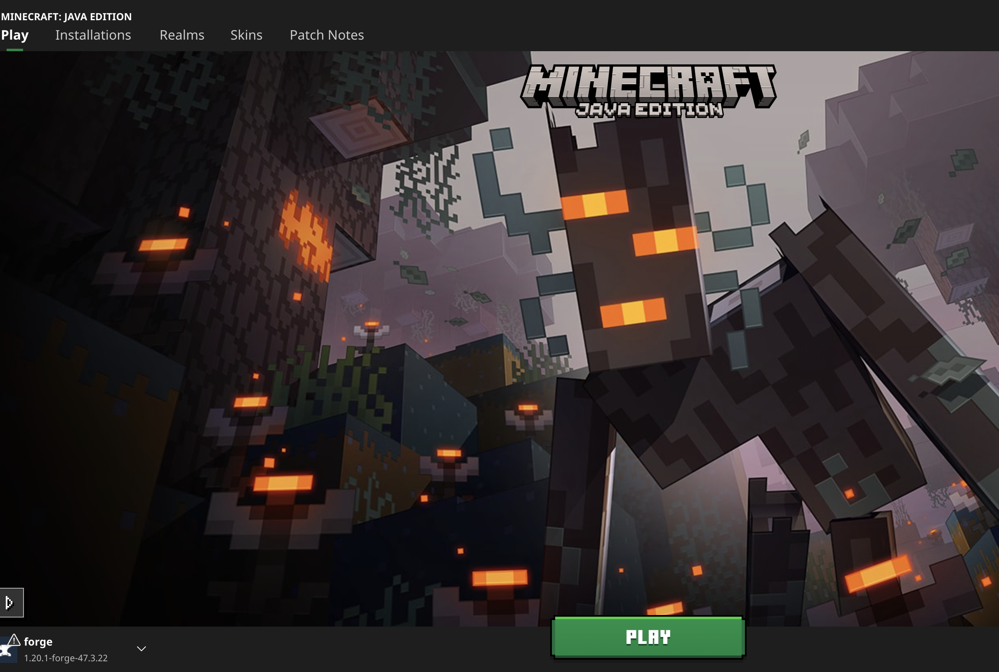

# Minecraft Mods Collection and Instructions
This repo contains a few mods and instructions to add these mods to your Minecraft

## Mods
1. [Alex's Mobs](https://www.curseforge.com/minecraft/mc-mods/alexs-mobs): Adds a variety of new mobs to the game
2. [Alex's Cave](https://www.curseforge.com/minecraft/mc-mods/alexs-caves): Adds a variety of new caves to the game
3. [Mutant Monsters](https://www.curseforge.com/minecraft/mc-mods/mutant-monsters): Adds a variety of new monsters to the game
## Instructions:
The Minecraft version we are using is 1.20.1, so make sure you downloaded `forge` and mods for this version.
### For Mac Users
1. Download forge from [here](forge/forge-1.20.1-47.3.22-installer.jar)
2. Open terminal by `cmd + space` and type `terminal`
3. Navigate to the directory where you downloaded the `forge` file (`cd ~/Downloads`)
4. Run the `forge` file by typing `java -jar forge-1.20.1-47.3.22-installer.jar`. Note, if you don't have `java` installed, you can download it use `brew install java`
5. After that, open Minecraft launcher, you should see the default profile is named `forge` on the left bottom corner of your screen as shown below

6. Click on the `forge` profile and click `Play`, then click on `Mod` and `Open Mod Folder`
7. Copy the [mods](mods) in this repo you downloaded to the `mods` folder
8. Restart Minecraft and you should see the mods are loaded
### For Windows Users
1. Download forge from [here](forge/forge-1.20.1-47.3.22-installer.jar)
2. Download `Java` from [here](https://www.java.com/download/ie_manual.jsp)
3. Run the `forge` file by double-clicking it, if it doesn't work, you can right-click it and choose `Open with` and choose `Java`
4. After that, open Minecraft launcher, you should see the default profile is named `forge` on the left bottom corner of your screen as shown below

5. Click on the `forge` profile and click `Play`, then click on `Mod` and `Open Mod Folder`
6. Copy the [mods](mods) in this repo you downloaded to the `mods` folder
7. Restart Minecraft and you should see the mods are loaded